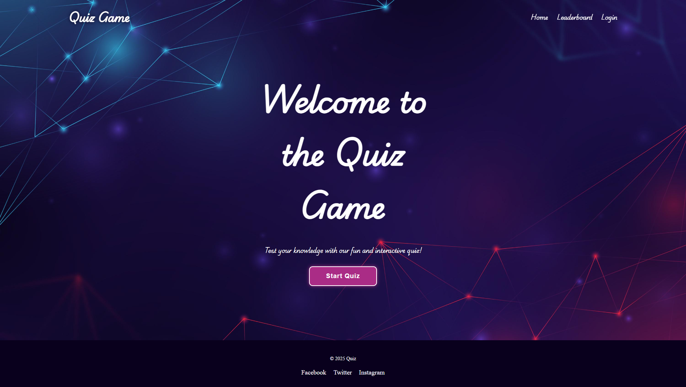
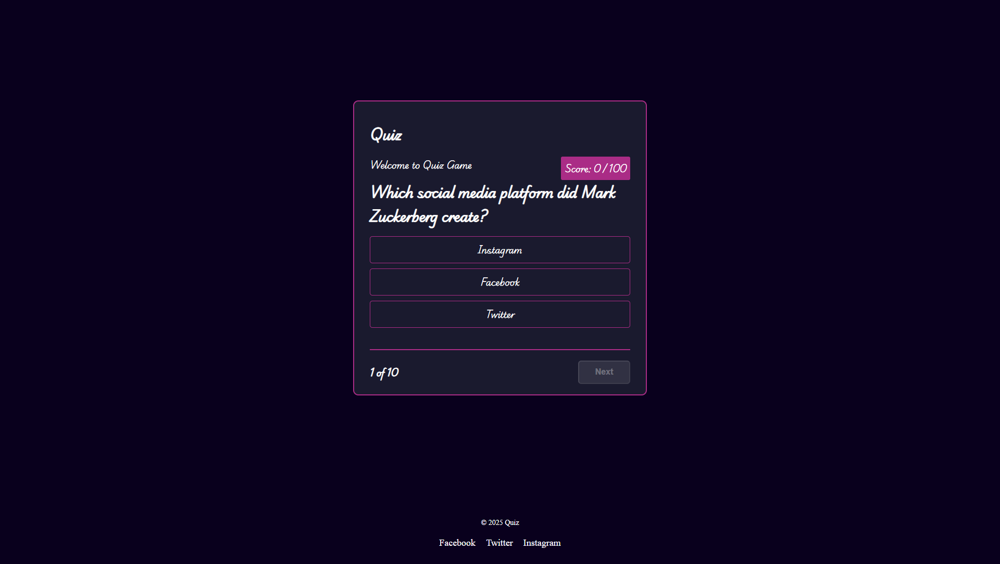
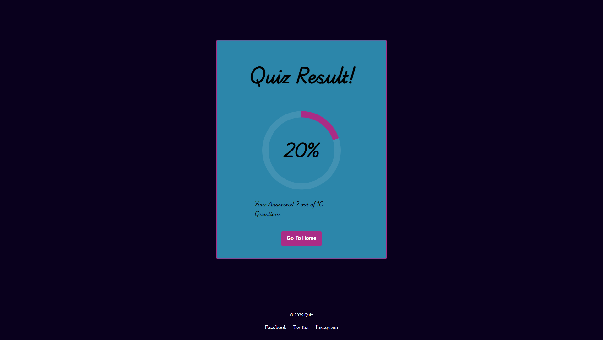
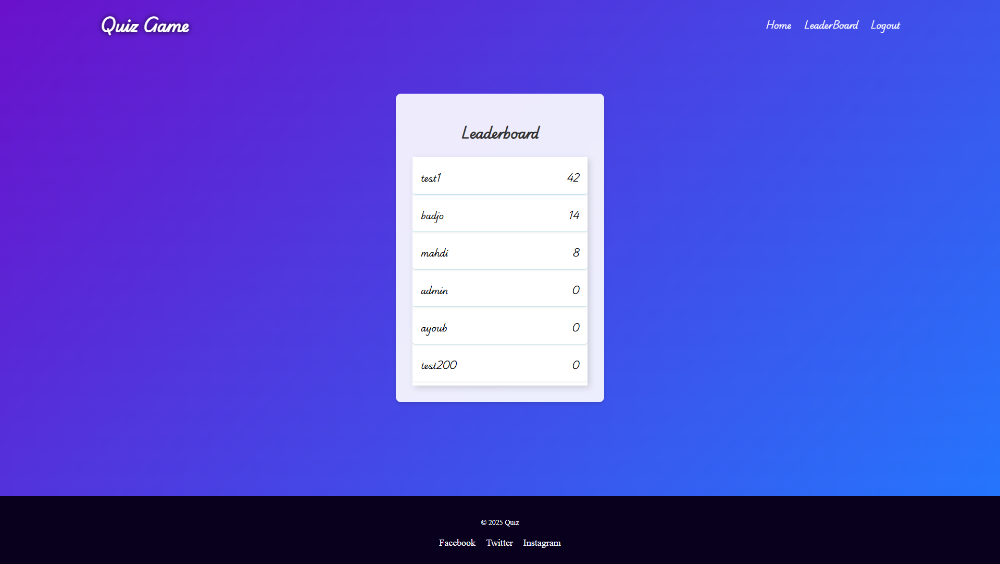

# Quiz Game Application

A full-stack quiz application built with Angular and Flask, featuring real-time scoring, leaderboards, and user authentication.

## 📸 Screenshots

### Home Page

*Home page interface*

### Quiz Guide

*Quiz Guide for users*

### Quiz Interface

*Active quiz session with multiple-choice questions*

### Quiz Results

*Quiz results displaying score and performance*

### Leaderboard

*Global leaderboard showing top scores*

## ✨ Features

- 🔐 **User Authentication** - Secure login and registration system
- 📝 **Multiple Quiz Categories** - Various topics and difficulty levels
- ⏱️ **Real-time Scoring** - Instant feedback and score calculation
- 🏆 **Global Leaderboard** - Compare your performance with other users
- 🎨 **Modern UI** - Responsive design that works on all devices
- 🔄 **Dynamic Questions** - Questions loaded dynamically from the database
- 📊 **Progress Tracking** - Track your quiz completion and scores
- 🎯 **Interactive Experience** - Smooth transitions and user-friendly interface

## 🛠️ Technologies Used

### Frontend
- **Angular 17** - Modern web framework
- **TypeScript** - Type-safe JavaScript
- **CSS3** - Modern styling and animations
- **RxJS** - Reactive programming for Angular

### Backend
- **Python 3.x** - Server-side programming
- **Flask** - Lightweight web framework
- **SQLite** - Database for storing users and quiz data
- **Flask-SQLAlchemy** - ORM for database operations
- **Flask-CORS** - Cross-origin resource sharing

## 🚀 Installation

### Prerequisites
- Node.js (v16 or higher)
- Python 3.7+
- Git

1. **Clone the repository:**
    ```bash
    git clone https://github.com/yourusername/quiz-game.git
    cd AngularQuiz
    ```

## 🐳 Running with Docker (Recommended)

The easiest way to run the application is using Docker:

### Prerequisites
- Docker installed on your system
- Docker Compose installed (usually included with Docker Desktop)

### Quick Start with Docker Compose

Run both frontend and backend services with a single command:

```bash
docker-compose up --build
```

This will:
- Build the Angular frontend and serve it on `http://localhost:4200`
- Build and start the Flask backend on `http://localhost:5000`
- Automatically handle service dependencies

**Access the application:** Open your browser and go to `http://localhost:4200`

### Docker Commands

```bash
# Run in detached mode (background)
docker-compose up -d --build

# Stop the services
docker-compose down

# View logs
docker-compose logs -f

# Rebuild only specific service
docker-compose up --build frontend
docker-compose up --build backend
```

### Running Individual Containers

**Frontend only:**
```bash
cd frontend/quiz-web
docker build -t quiz-frontend .
docker run -p 4200:80 quiz-frontend
```

**Backend only:**
```bash
cd backend
docker build -t quiz-backend .
docker run -p 5000:5000 quiz-backend
```

## 🔧 Manual Installation (Alternative)

### Frontend Setup

2. **Navigate to the frontend directory and install dependencies:**
    ```bash
    cd frontend/quiz-web
    npm install
    ```

3. **Run the Angular development server:**
    ```bash
    ng serve
    ```

    The frontend will be available at `http://localhost:4200`

### Backend Setup

4. **Navigate to the backend directory and create a virtual environment:**
    ```bash
    cd backend
    python -m venv venv
    
    # Activate virtual environment
    source venv/bin/activate  # On Linux/Mac
    # OR
    venv\Scripts\activate     # On Windows
    ```

5. **Install the required Python packages:**
    ```bash
    pip install -r requirements.txt
    ```

6. **Initialize the database and run the Flask server:**
    ```bash
    python run.py
    ```

    The backend server will be running at `http://localhost:5000`

## 🎮 Usage

1. **Access the Application:** Open your browser and navigate to `http://localhost:4200`
2. **Create Account:** Register a new user account or login with existing credentials
3. **Start Quiz:** Browse available quizzes and select one to start
4. **Answer Questions:** Complete the quiz by answering multiple-choice questions
5. **View Results:** See your score and review correct answers
6. **Check Leaderboard:** Compare your performance with other users

## 🏗️ Project Structure

```
AngularQuiz/
├── frontend/
│   └── quiz-web/           # Angular application
│       ├── src/
│       ├── package.json
│       └── Dockerfile
├── backend/                # Flask API
│   ├── app/
│   ├── requirements.txt
│   ├── run.py
│   └── Dockerfile
├── docker-compose.yml
├── screenshots/
└── README.md
```

## 🔗 API Endpoints

### Authentication
- `POST /api/auth/register` - Register new user
- `POST /api/auth/login` - User login
- `POST /api/auth/logout` - User logout

### Quizzes
- `GET /api/quizzes` - Get all available quizzes
- `GET /api/quizzes/:id` - Get specific quiz
- `POST /api/quizzes/:id/submit` - Submit quiz answers

### Leaderboard
- `GET /api/leaderboard` - Get top scores

## 🤝 Contributing

1. Fork the repository
2. Create a feature branch (`git checkout -b feature/amazing-feature`)
3. Commit your changes (`git commit -m 'Add some amazing feature'`)
4. Push to the branch (`git push origin feature/amazing-feature`)
5. Open a Pull Request

## 🐛 Troubleshooting

### Common Issues

**Frontend not loading:**
- Ensure Node.js is installed and updated
- Run `npm install` in the frontend directory
- Check if port 4200 is available

**Backend connection errors:**
- Verify Python virtual environment is activated
- Ensure all dependencies are installed (`pip install -r requirements.txt`)
- Check if port 5000 is available

**Docker issues:**
- Ensure Docker is running
- Try `docker-compose down` and then `docker-compose up --build`

## 📄 License

This project is licensed under the MIT License - see the [LICENSE](LICENSE) file for details.

## 🙏 Acknowledgments

- Angular team for the excellent framework
- Flask community for the lightweight backend solution
- All contributors who helped improve this project

---

**Made with ❤️ using Angular and Flask**