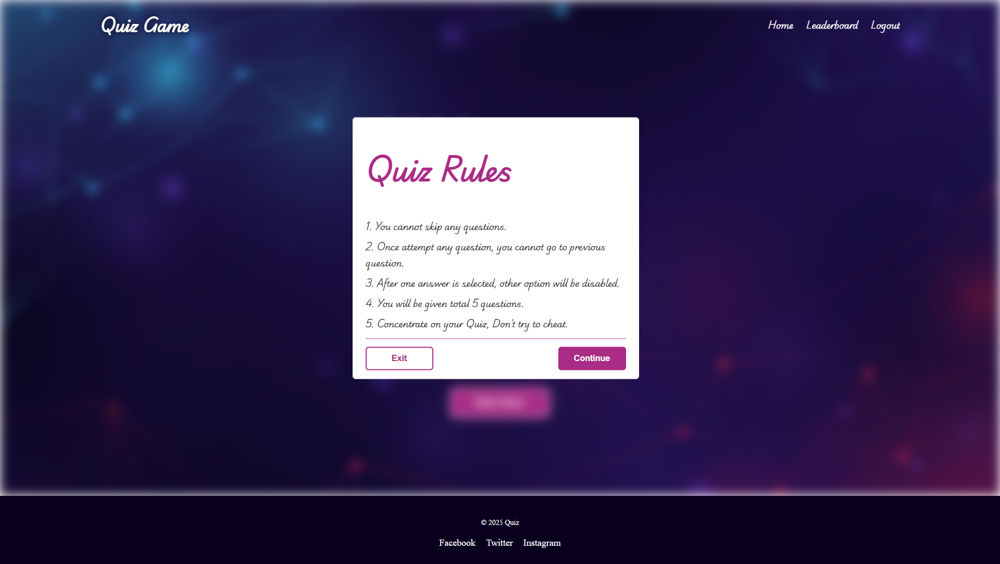

# Quiz Game Application

A full-stack quiz application built with Angular and Flask, featuring real-time scoring, leaderboards, and user authentication.

## Screenshots

### Home Page

*Home page interface*

### Quiz Guide

*Quiz Guide for users*

### Quiz Interface

*Active quiz session with multiple-choice questions*

### Quiz Results

*Quiz Guide for users*

### Leaderboard

*Global leaderboard showing top scores*

## Features

- 🔐 User authentication (login/register)
- 📝 Multiple quiz categories
- ⏱️ Real-time scoring system
- 🏆 Global leaderboard
- 🎨 Modern, responsive UI
- 🔄 Dynamic question loading

## Technologies Used

### Frontend
- Angular 17
- TypeScript
- CSS
- RxJS

### Backend
- Python/Flask
- SQLite
- Flask-SQLAlchemy
- Flask-CORS

## Installation

1. Clone the repository:
    ```bash
    git clone https://github.com/yourusername/quiz-game.git
    cd quiz-game
    ```

## Running with Docker (Recommended)

The easiest way to run the application is using Docker:

### Prerequisites
- Docker installed on your system
- Docker Compose installed (usually included with Docker Desktop)

### Quick Start with Docker Compose

Run both frontend and backend services with a single command:

```bash
docker-compose up --build
```

This will:
- Build the Angular frontend and serve it on `http://localhost:4200`
- Build and start the Flask backend on `http://localhost:5000`

To run in detached mode (background):

```bash
docker-compose up -d --build
```

To stop the services:

```bash
docker-compose down
```

### Running Frontend Container Only

If you only want to run the frontend:

```bash
# Build the Docker image
cd frontend/quiz-web
docker build -t quiz-frontend .

# Run the container
docker run -p 4200:80 quiz-frontend
```

Access the application at `http://localhost:4200`

## Manual Installation (Alternative)

### Frontend Setup

2. Navigate to the frontend directory and install dependencies:
    ```bash
    cd frontend/quiz-web
    npm install
    ```

3. Run the Angular development server:
    ```bash
    ng serve
    ```

### Backend Setup

4. Navigate to the backend directory and create a virtual environment:
    ```bash
    cd backend
    python -m venv venv
    source venv/bin/activate  # On Windows use `venv\Scripts\activate`
    ```

5. Install the required Python packages:
    ```bash
    pip install -r requirements.txt
    ```

6. Initialize the database and run the Flask server:
    ```bash
    python run.py
    ```

The backend server should now be running at `http://localhost:5000`.

## Usage

1. Open your browser and navigate to `http://localhost:4200` to access the frontend.
2. Register a new user or login with existing credentials.
3. Start playing quizzes and see your scores on the leaderboard.

## License

This project is licensed under the MIT License.